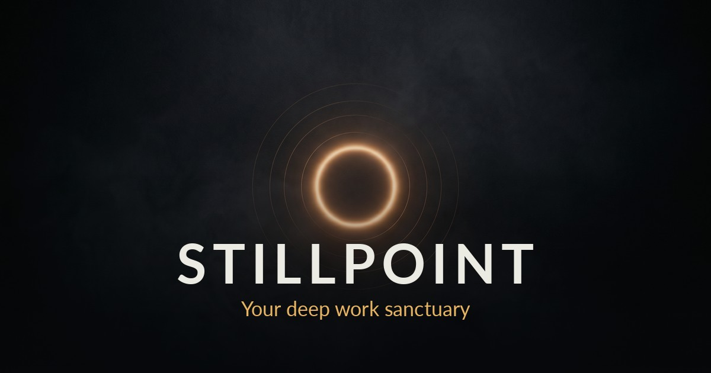
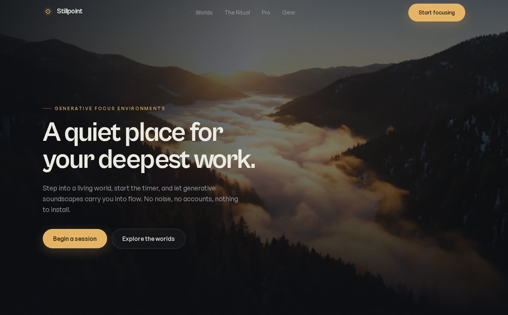
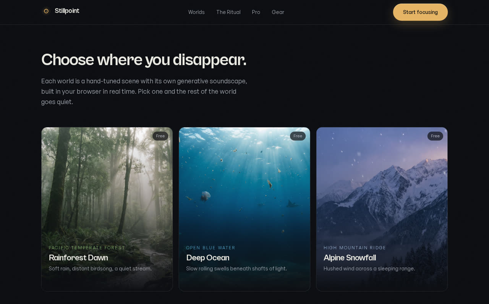
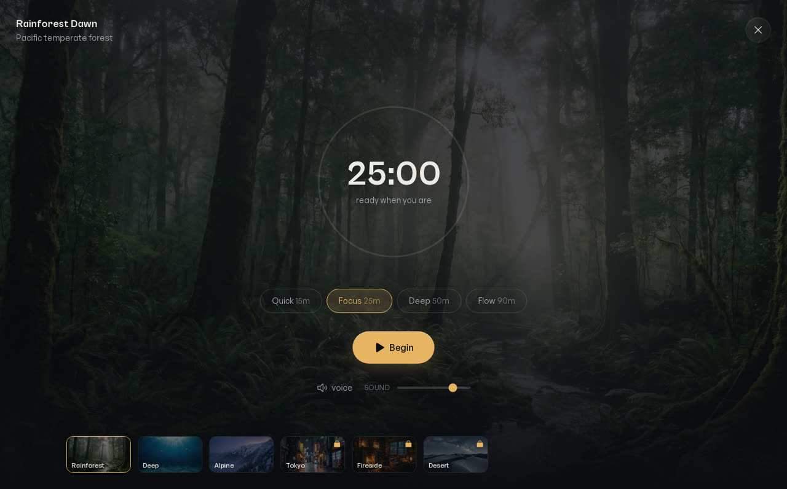

<div align="center">



# Stillpoint

### Your deep work sanctuary.

Step into a living world, start a timer, and let generative soundscapes carry your deepest work.
Free, no account, works offline.

**[ Live site ](https://stillpoint-livid.vercel.app)** · built with React, Vite, Tailwind and the Web Audio API

</div>

---

## What this is

Stillpoint is a focus app that turns deep work into a ritual. You pick one of six cinematic
worlds, set a timer, and a calm voice settles you in while a generative soundscape rises around
you. When the session ends you get a shareable focus card and your streak ticks up.

It is designed to be genuinely useful, quietly beautiful, and shareable.

<table>
  <tr>
    <td></td>
    <td></td>
  </tr>
  <tr>
    <td colspan="2"></td>
  </tr>
</table>

## Features

- **Sound Mixer** — blend rain, ocean, wind, fire, birds, crickets, stream and a deep hum into your own atmosphere, each layer with its own volume. Four one-tap presets included.
- **Installable PWA** — add to home screen and run fully offline thanks to a service worker.
- **Stats dashboard** — streaks, total sessions and hours, plus a 14-week focus heatmap, all stored on-device.
- **Open-ended ambient mode** — skip the timer and just stay in the world for as long as you like. Space bar starts and pauses.
- **Six living worlds** — rainforest, deep ocean, alpine snowfall, Tokyo rain, fireside cabin, desert night. Each is a generative motion-video scene that breathes and moves behind your session, with its own soundscape.
- **Generative audio, not streamed** — every soundscape is synthesised live in the browser from layered noise plus randomised droplet, crackle and chirp events. Nothing loops, nothing repeats, and it works fully offline. See [`src/lib/audio.ts`](src/lib/audio.ts).
- **A real focus timer** — 15 / 25 / 50 / 90 minute presets with a breathing progress ring, pause and resume, and a guided voice intention at the start and finish.
- **Streaks and history** — daily streaks, total sessions and hours, stored locally. No account, no tracking.
- **Shareable focus cards** — every completed session renders a canvas image you can post or save. This is the growth loop.
- **Fast and accessible** — ~128 KB of gzipped JS, respects `prefers-reduced-motion`, keyboard friendly, WCAG-minded contrast, full Open Graph and structured data.

## The audio engine

The signature piece. Instead of shipping audio files, Stillpoint describes each world as a
recipe of layers and builds the sound in real time:

- **Noise beds** — white / pink / brown noise generated into looping buffers, shaped with biquad filters and slow LFOs for movement.
- **Event generators** — randomly scheduled water drops, fire crackles and bird / cricket chirps, each panned and enveloped on the fly.

The result: rain that never loops, a fire that never repeats, zero bandwidth, zero licensing,
and a sound that never plays the same minute twice.

## Tech stack

| | |
|---|---|
| Framework | React 19 + TypeScript |
| Build | Vite |
| Styling | Tailwind CSS |
| Motion | Motion (Framer Motion) |
| Icons | Phosphor |
| Audio | Web Audio API (no dependencies) |
| Media | Hero video, world art and voice were generated with AI; processed with ffmpeg |

## Run it locally

```bash
npm install
npm run dev      # http://localhost:5173
npm run build    # production build to dist/
npm run preview  # preview the build
```

## Deploy

This repo deploys to Vercel with zero config (Vite preset). Push to GitHub, import the repo in
Vercel, and you are live.

## License

MIT. See [LICENSE](LICENSE). The AI-generated media in `public/` is yours to use for this project.
